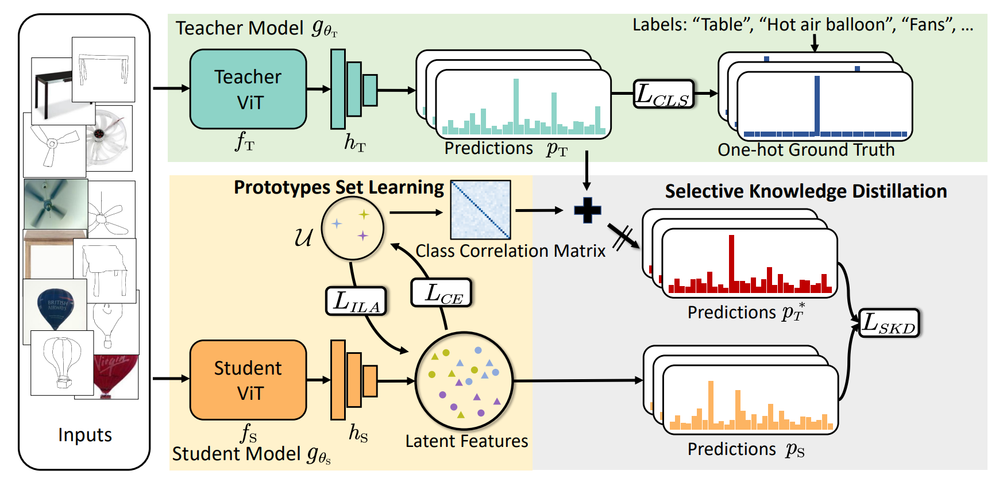
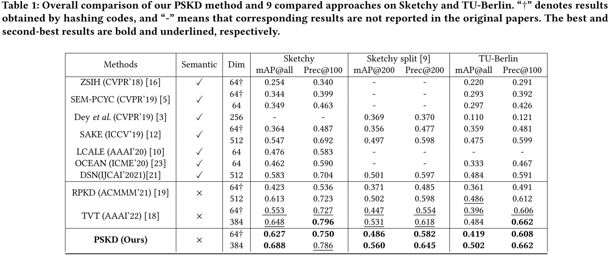
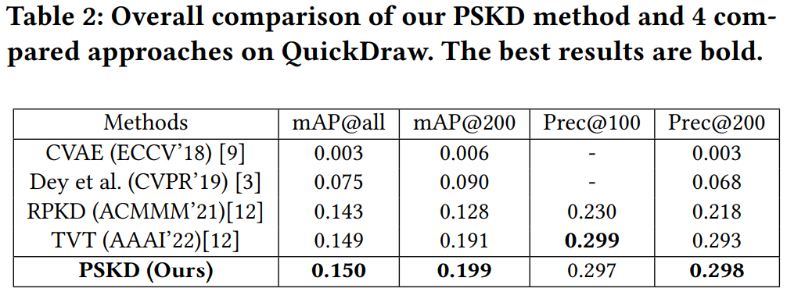
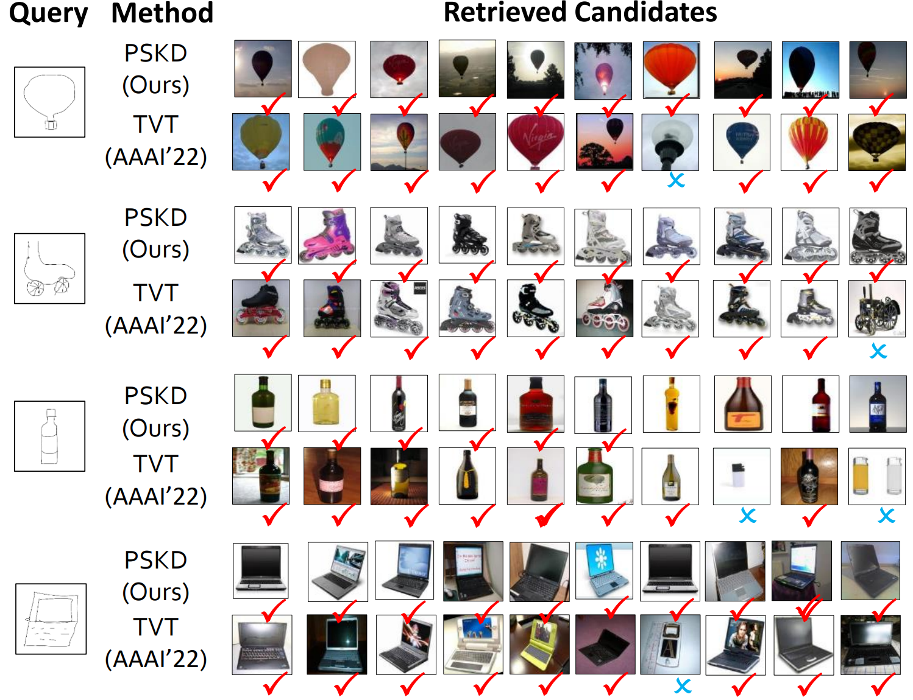

# Prototype-based Selective knowledge Distillation for Zero-Shot Sketch Based Image Retrieval
This repository is the anonymous Pytorch implementation of the PSKD method.

## Main Idea
we propose a Prototype-based Selective Knowledge Distillation (PSKD) method for ZS-SBIR. The model would first learn a set of prototypes to represent categories and then utilize an instance-level adaptive learning strategy to strengthen semantic relations between categories. Afterward, a correlation matrix targeted for the downstream task would be established through the prototypes. With the correlation matrix, the teacher signal given by transformers pre-trained on ImageNet and fine-tuned on the downstream dataset, can be reconstructed to weaken the impact of mispredictions and selectively distill knowledge on the student network. We perform the experiment on three widely-used datasets on ZS-SBIR, and the results exhibit that PSKD establishes the new state-of-the-art performance on all datasets.
## The State-of-the-art Performance

## Visulization

## Installation and Requirements

### Installation

- Python 3.7
- PyTorch 1.8.1
- Numpy 1.22.0

### Prepare datasets and pre-trained models
Download **Sketchy Extended** and **TU-Berlin** dataset by following [SEM-PCYC](https://github.com/AnjanDutta/sem-pcyc).

### Training & Testing
 #### Training on Teacher Network
##### Sketchy 
     python -m torch.distributed.launch  --nproc_per_node=2 myvit_firststage.py --arch vit_small_fd --patch_size 8 --out_dim 65536 --norm_last_layer False --warmup_teacher_temp 0.04 --teacher_temp 0.07 --warmup_teacher_temp_epochs 5 --use_fp16 False --weight_decay 0.04 --weight_decay_end 0.4 --clip_grad 3.0 --batch_size_per_gpu 256 --epochs 5 --freeze_last_layer 1 --lr 0.0005 --warmup_epochs 5 --min_lr 1e-6 --global_crops_scale 0.14 1.0 --global_crops_number 1 --local_crops_scale 0.05 0.4 --local_crops_number 0 --seed 0 --num_workers 4 --optimizer adamw --momentum_teacher 0.996 --use_bn_in_head False --drop_path_rate 0.1 --gradient_accumulation_steps 16  --dataset sketchy --resume_pretrain 1 --split zeroshot --disable_dropout 1 --skt_factor 2 --token_num 2 --data_path  
      
##### TU-Berlin
     python -m torch.distributed.launch  --nproc_per_node=2 myvit_firststage.py --arch vit_small_fd --patch_size 8 --out_dim 65536 --norm_last_layer False --warmup_teacher_temp 0.04 --teacher_temp 0.07 --warmup_teacher_temp_epochs 5 --use_fp16 False --weight_decay 0.04 --weight_decay_end 0.4 --clip_grad 3.0 --batch_size_per_gpu 256 --epochs 5 --freeze_last_layer 1 --lr 0.0005 --warmup_epochs 5 --min_lr 1e-6 --global_crops_scale 0.14 1.0 --global_crops_number 1 --local_crops_scale 0.05 0.4 --local_crops_number 0 --seed 0 --num_workers 4 --optimizer adamw --momentum_teacher 0.996 --use_bn_in_head False --drop_path_rate 0.1 --gradient_accumulation_steps 16  --dataset tuberlin --resume_pretrain 1 --split random2 --disable_dropout 1 --skt_factor 2 --token_num 2 
      
 #### Training on Student Network
##### Sketchy 
     python -m torch.distributed.launch   --nproc_per_node=2 myvit_secondstage2.py --arch vit_small_fd --arch_teacher vit_small_fd --patch_size 8 --out_dim 65536 --norm_last_layer False --warmup_teacher_temp 0.04 --teacher_temp 0.07 --warmup_teacher_temp_epochs 5 --use_fp16 False --weight_decay 0.04 --weight_decay_end 0.4 --clip_grad 3.0 --batch_size_per_gpu 128 --epochs 50 --freeze_last_layer 1 --lr 0.0005 --warmup_epochs 5 --min_lr 1e-6 --global_crops_scale 0.14 1.0 --global_crops_number 1 --local_crops_scale 0.05 0.4 --local_crops_number 0 --seed 0 --num_workers 4 --optimizer adamw --momentum_teacher 0.996 --use_bn_in_head False --drop_path_rate 0.1 --gradient_accumulation_steps 16  --dataset sketchy --resume_pretrain 1 --split zeroshot --disable_dropout 1 --skt_factor 2 --token_num 2 
      
##### TU-Berlin
      python -m torch.distributed.launch --nproc_per_node=2 myvit_secondstage2.py --arch vit_small_fd --arch_tea vit_small --patch_size 8 --out_dim 65536 --norm_last_layer False --warmup_teacher_temp 0.04 --teacher_temp 0.07 --warmup_teacher_temp_epochs 5 --use_fp16 False --weight_decay 0.04 --weight_decay_end 0.4 --clip_grad 3.0 --batch_size_per_gpu 128 --epochs 50 --freeze_last_layer 1 --lr 0.0005 --warmup_epochs 5 --min_lr 1e-6 --global_crops_scale 0.14 1.0 --global_crops_number 1 --local_crops_scale 0.05 0.4 --local_crops_number 0 --seed 0 --num_workers 4 --optimizer adamw --momentum_teacher 0.996 --use_bn_in_head False --drop_path_rate 0.1 --gradient_accumulation_steps 16  --dataset tuberlin --resume_pretrain 1 --split random2 --disable_dropout 1 --skt_factor 2 --token_num 2
 #### Testing
 ##### Sketchy 
      python -m torch.distributed.launch --master_port=65021 --use_env --nproc_per_node=1 eval_myvit.py --imsize 224 --multiscale 0  --dataset sketchy --arch vit_small_fd --patch_size 8 --preck 100   --use_train 0 --intra_modal 0 --use_cuda True --split zeroshot --token_num 2 --num_classes 104 --return_idx 0 
      
 ##### TU-Berlin
      python -m torch.distributed.launch --master_port= --use_env --nproc_per_node=1 eval_myvit.py --imsize 224 --multiscale 0  --dataset tuberlin --arch vit_small_fd --patch_size 8 --preck 100   --use_train 0 --intra_modal 0 --use_cuda True --split random2 --token_num 2 --num_classes 220 --return_idx 0 

